# 중간메모

### 1강 - 아파치 카프카 개요 및 설명

https://www.youtube.com/watch?v=waw0XXNX-uQ

### 2강 - 토픽이란?

https://www.youtube.com/watch?v=7QfEpRTRdIQ

### 3강 - 브로커, 복제, ISR(In-Sync-Replication)

3강 - [아파치 카프카 | Broker, Replication, ISR 👀핵심요소 3가지!](https://www.youtube.com/watch?v=qpEEoGpWVig)

 

가만히 앉아서 듣기만 하면 개꿀일줄 알았는데, 3강부터는 필기해야 머릿속에 기억에 남았었다... 역시 쉬운일이란 없다. 

 

프로듀서의 역할

토픽을 파티션에 전달한다.

브로커, 파티션

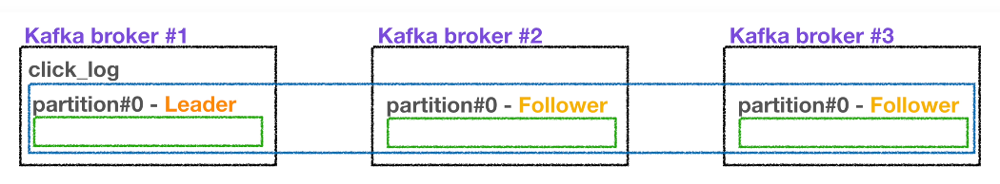

브로커는 여러 대 존재할 수 있다.

파티션은 브로커마다 여러대 설정할 수 있다.

리더 파티션을 설정하고, 다른 파티션을 팔로워 파티션으로 해서 복제본을 저장해두는 것 역시 가능하다.

#### 리더파티션과 팔로워 파티션의 역할

프로듀서가 토픽의 파티션에 데이터를 전달할 때 전달받는 주체가 Leader Partition 이다.

프로듀서에는 ack 라는 상세 옵션이 있다.

ack를 통해 고가용성을 유지할 수 있다.

이 옵션은 파티션의 레플리케이션과 관계있다.

ack 는 0, 1, all 이렇게 3개중 하나를 골라서 사용할 수 있다.

ack = 0 일 경우

- 프로듀서는 리더파티션에 데이터를 전송하고 응답값을 받지 않는다.

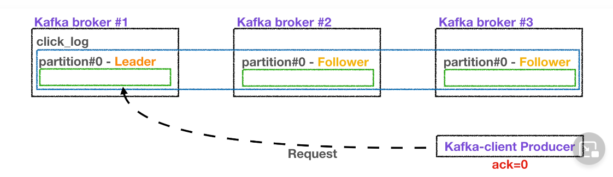

- 응답값을 받지 않기 때문에 Leader Partition 에 데이터가 정상적으로 전송됐는지, 나머지 파티션에 데이터가 정상적으로 복제되었는지 알수 없고, 보장할 수 없다.
- 이런 이유로 ack=0 일 때는 속도는 빠르지만, 데이터 유실 가능성이 있다.

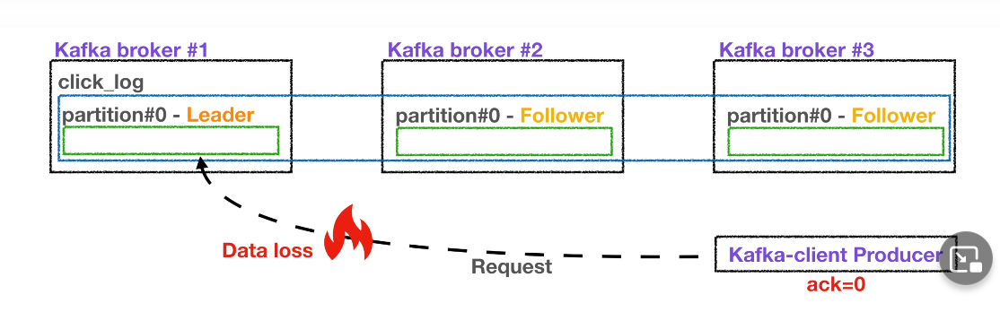

ack=1 일 경우

- Leader Partition 에 데이터를 전송하고, Leader Partition 이 데이터를 정상적으로 받았는지 응답값을 받는다.
- 다만, 나머지 partition 에 복제되었는지는 알 수 없다.

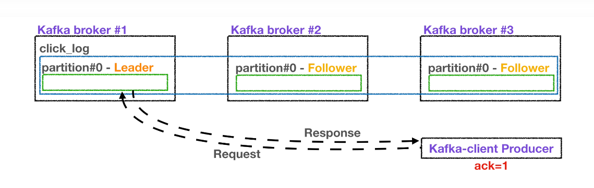

- 만약, 리더 파티션이 데이터를 받은 직후 장애가 나면 나머지 partition 에 데이터가 미처 전송되지 못한 상태이기에 ack=0 옵션 처럼 데이터 유실 가능성이 있다.

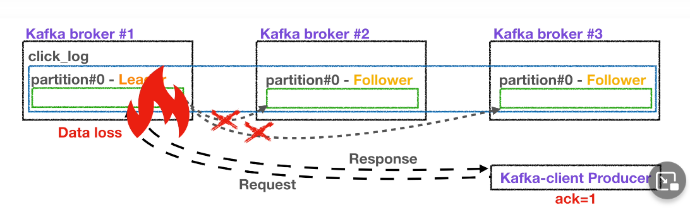

ack=all 옵션

- 1 옵션에서 하는 기능에 follower partition 에 대한 기능이 추가된 기능
- follower partition 에 복제가 잘 이루어졌는지 응답값을 받는다.

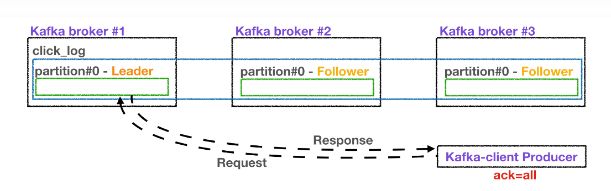

- Leader partition 에 데이터를 보낸 후 나머지 Follower Partition 에도 데이터가 정상적으로 저장되는지 확인하는 절차를 거친다.

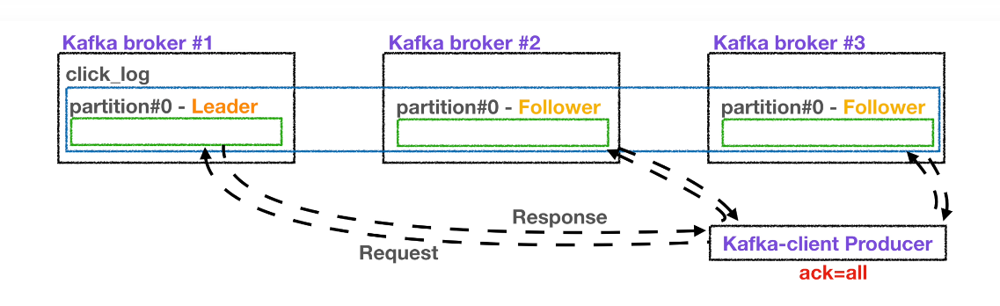

- ack=1, ack=0 일 때에 비해 확인하는 부분이 많기에 속도가 느리다는 단점 역시 존재한다.

 

#### replication 이 많을수록 좋은거 아니야?

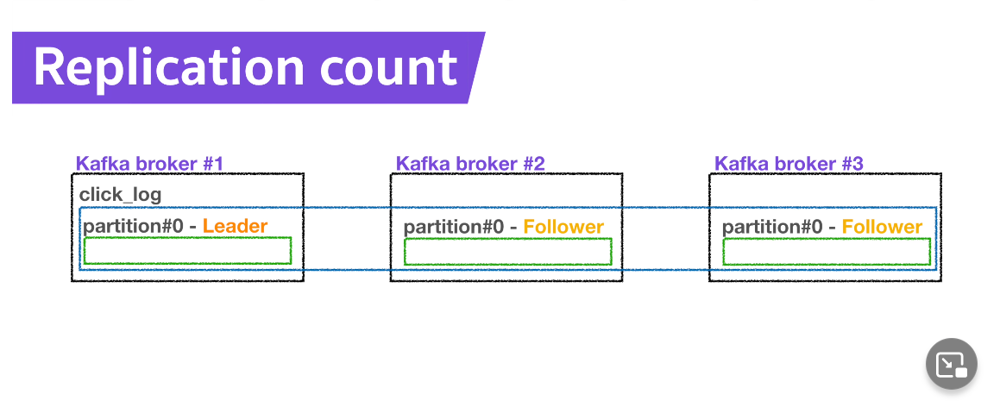

하지만, 레플리케이션 갯수가 많아지면, 브로커가 사용하는 리소스 사용량도 같이 늘어나게 된다.

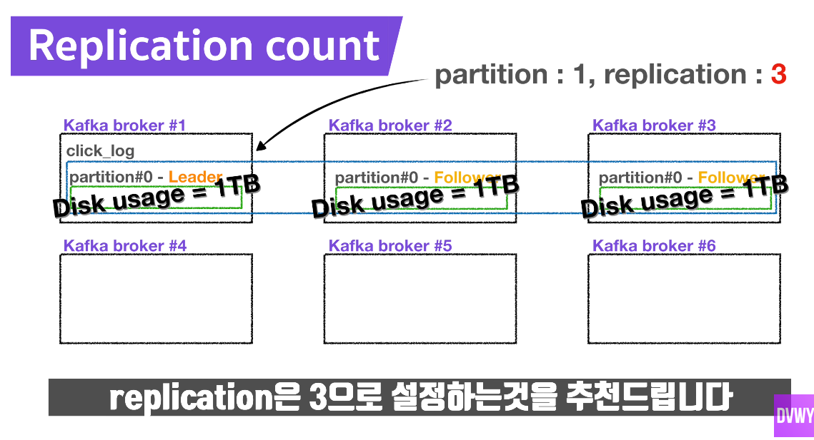

따라서 카프카에 들어오는 데이터 양과 retention date 즉, 저장시간을 잘 생각해서 replication 갯수를 잘 정하는 것이 좋다. 

3개 이상의 브로커를 사용할 때, replication 은 3으로 설정하는 것을 추천한다.

 

### 4강 - 파티셔너란?

[4강 - 파티셔너의 역할과 동작! 파티션으로 가는 길목!](https://www.youtube.com/watch?v=-vKiNUH5OT8)

 

파티셔너를 알면 파티션을 효과적으로 사용할 수 있다. 

 

#### 파티셔너의 역할

프로듀서가 데이터를 보내면, 무조건 파티셔너를 통해서 브로커로 데이터가 전송된다.

파티셔너는 데이터를 어떤 파티션으로 넣을지 결정한다.

레코드에 포함된 메시지 키 or 메시지 값에 따라 파티션의 위치가 결정된다.

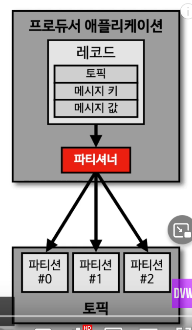

#### UniformStickyPartitioner

프로듀서를 사용할 때 파티셔너를 따로 설정하지 않는다면, UniformStickyPartitioner 로 설정된다. 

UniformStickyPatitioner 는 메시지 키가 있을때, 없을때 각각 다르게 동작한다.

 

##### 메시지 키가 있을 때

메시지 키를 가진 레코드는 파티셔너의 해시 알고리즘으로 파티션 번호를 해시값으로 생성할 수 있다.

동일한 메시지 키를 가진 레코드는 동일한 해시값을 만들어내기 때문에 항상 동일한 파티션에 들어가는 것을 보장한다.

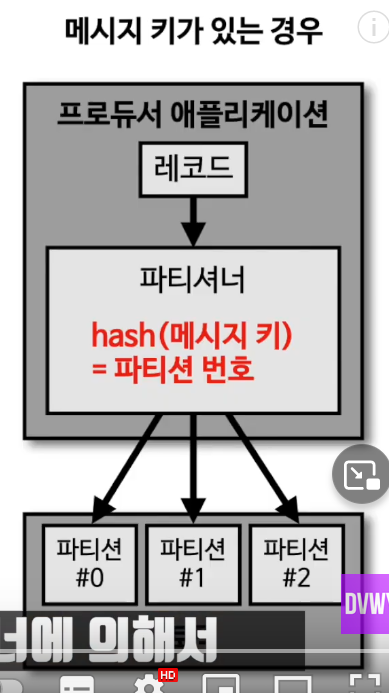

 

이렇게 동일한 키를 가진 레코드 들은 동일한 파티션에 들어가는 것을 보장한다.

따라서 순서를 지켜서 데이터를 처리할 수 있다는 장점이 있다. 

(응? 강의에서 언급하는 이 부분은 조금 의미가 이상하다.  순서를 지킨다는 말은 좀 이상한데... FIFO와 혼동될법한데...) 

e.g. 

- 메시지 키 = 서울 => 파티션 0번 
- 메시지 키 = 울산 => 파티션 0번
- 메시지 키 = 부산 => 파티션 1번

예로 든 내용 역시 순서라기보다는 범위를 구분할 수 있다는 의미로 보인다.

(참고로, 파티션 한개일 경우에만 FIFO처럼 동작할 수 있는데, 실제로 이렇게 구성되는 케이스는 많지 않다.)

 

##### e.g. 서울, 부산

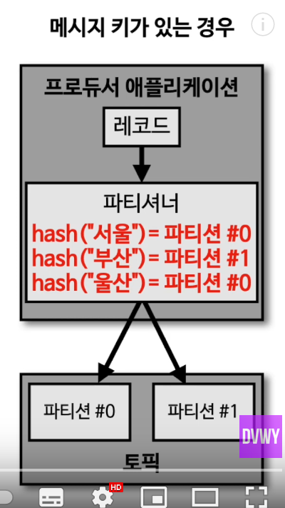

#####  메시지 키가 없을 때

메시지 키가 없는 레코드는 라운드 로빈으로 파티션에 들어간다.

단, 전통적인 라운드 로빈 방식과는 조금 다르게 동작한다.

UniformStickyPartitioner 는 프로듀서에서 배치로 모을수 있는 최대한의 레코드를 모아서

파티션으로 데이터를 보내게 된다.

이렇게 배치 단위로 데이터를 보낼 때 파티션에 라운드 로빈 방식으로 돌아가면서 데이터를 넣게 된다.

 

쉽게 말해 메시지키가 없는 레코드 들은 

파티션에 적절하게 (내부적인 동작으로) 분배된다고 생각하면 될것 같습니다.

#### 커스텀 파티셔너

그럼 우리는 직접 개발한 파티셔너만 사용할 수 있을까요?

그렇지 않습니다.

직접 개발한 파티셔너도 우리가 프로듀서에서 설정할 수 있는데요.

카프카에서는 커스텀 파티셔너를 만들 수 있도록 `Partitioner` 인터페이스를 제공하고 있습니다.

`Partitioner` 인터페이스를 사용해서 커스텀 파티셔너 클래스를 만들면 

메시지 키 또는 메시지 값 또는 토픽 이름에 따라서 어느 파티션에 데이터를 보낼 것인지 정할 수 있습니다.

##### 커스텀 파티셔너를 사용하는 경우

e.g. VIP 고객을 위해서 데이터 처리를 조금 더 빠르게 하는 로직을 생각해볼 수 있을 것 같아요.

VIP 고객의 데이터를 조금 더 빠르게 처리해주고 싶다면

파티셔너를 통해서 처리량을 조금 더 늘릴수도 있습니다.

기본적으로 10개의 파티션이 있다고 가정할 때

우리가 커스텀 파티셔너를 만들어서

8개의 파티션에는 VIP 고객의 데이터를 저장하고

2개의 파티션에는 일반 고객의 데이터를 넣는 것

데이터 처리량을 조금 더 vip 고객을 위해서 몰아주는 형태로 개발할 수도 있습니다.

이것은 마치 AMQP 기반 메시징 시스템 같은 곳에서 우선순위 큐를 만드는 것과 비슷하다고 볼수 있습니다.

(응?... 흠...;;; )

