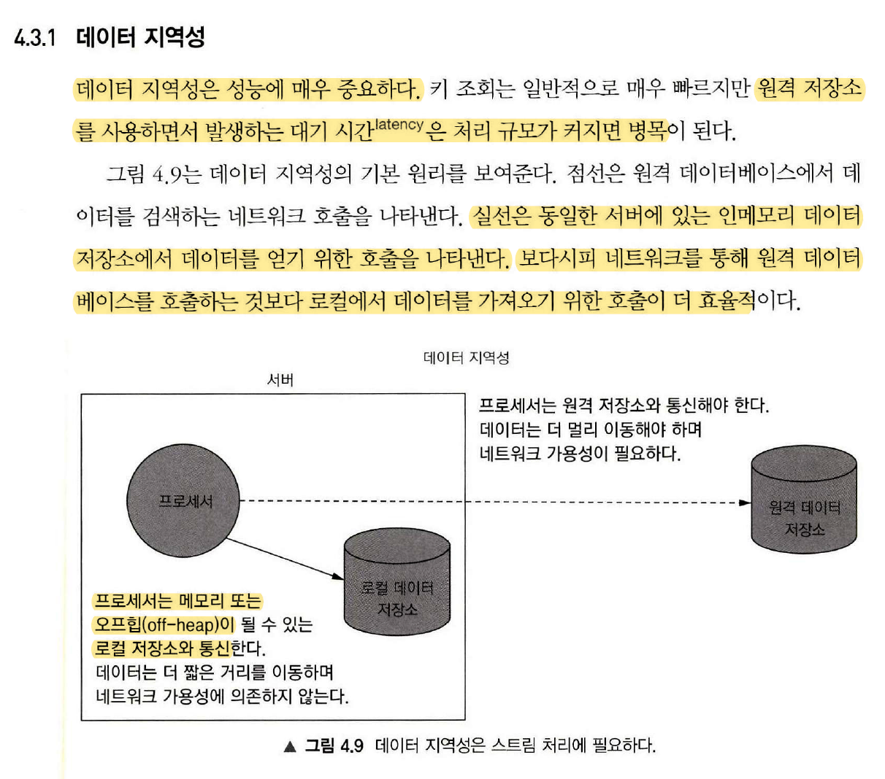
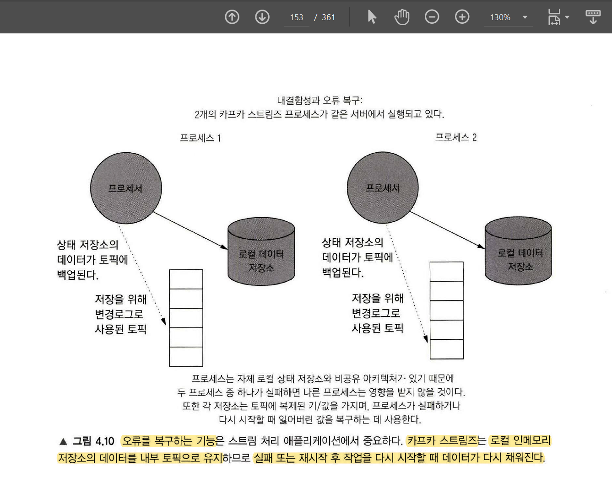

# Chapter 4 를 읽으면서(feat. offheap 저장소)

카프카 스트림즈에서는 off heap 기반의 로컬 인메모리 저장소를 제공해준다.

그리고 이 인메모리 저장소에 대한 API 라이브러리 역시 기본으로 제공해준다. 매우 개발하기 편리한 환경이다.

 

내 경우는 전 직장에서 어쩔 수 없이 RabbitMQ를 선택해서 개발을 진행해야 했는데, RabbitMQ에 대한 스프링에서의 client 라이브러리인 spring-amqp 에서는 off heap 저장소/라이브러리를 제공해주지 않았다. 그래서 hazelcast 라는 인메모리 그리드 저장소를 따로 사용했다. 그리고 자료구조에 대한 API를 직접 개발하고 테스트까지 모두 직접 했다. 

 

그런데, 카프카에서는 이 모든 것이 자동으로 제공해준다!!! 조금 놀랐다. 

현업에서 더 써보다보면 더 확장시켜서 써야하고 이런 점들도 있겠지만, 다소 놀라웠다. 이렇게 편리하다니..!!!

카프카 스트림즈 꽤 좋은데?

 

