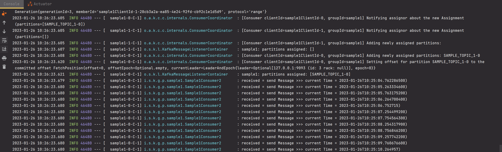

# Kafka 프로듀서, 컨슈머 단순 예제

뭔가 어렵고 그런건 아닌데, 그냥 처음 시작할 때 예제를 어떤 식으로 돌려보는지를 정리해보고 싶어서 정리를 시작했다.

RabbitMQ를 사용해서 주식데이터처리 서버를 개발할때 RabbitMQ에 대해 모르는 상태에서 처음부터 개발했었다. 그때 처음 스터디할 때 docker를 기반으로 개발PC에 RabbitMQ를 설치했고 첫 예제는 @Scheduled 를 이용한 무한 생산하는 생산자, 소비를 담당하는 @RabbitListener 로직, MessageConverter 정의, ListenerContainerFactory 설정 등을 작성했었다.<br>

메시징 계열 스프링 부트 프로젝트들은 대부분 네이밍 컨벤션이 비슷해서 직관적으로 비슷한 코드로 쉽게 찾아갈 수 있도록 사용자에게 편의성을 제공하는 것 같아서 유용한 것 같다.<br>

<br>

오늘은 단순 예제다.

- 서버 애플리케이션이 구동되고 3초 뒤에 0.5초마다 한번씩 Kafka 로 Produce 하는 로직을 작성한다.
- 카프카로 보내진 데이터를 Consumer 로직을 통해 카프카 클라이언트 코드를 작성한다.
- 카프카 브로커는 docker-compose를 이용해 3대로 구성한다.

<br>


### docker-compose.yml

바쁘기도 하고 귀찮아서 안적으려고 했지만, 적어야겠다.

```yaml
version: '2'

services:
  zookeeper:
    image: confluentinc/cp-zookeeper:latest
    environment:
      ZOO_MY_ID: 1
      ZOO_PORT: 1
      ZOOKEEPER_SERVER_ID: 1
      ZOOKEEPER_CLIENT_PORT: 2181
      ZOOKEEPER_TICK_TIME: 2000
      ZOOKEEPER_INIT_LIMIT: 5
      ZOOKEEPER_SYNC_LIMIT: 2
    ports:
      - "22181:2181"
    volumes:
      - ./data/zookeeper/data:/data
      - ./data/zookeeper/datalog:/datalogco
  kafka1:
#    hostname: kafka1
    image: confluentinc/cp-kafka:latest
    depends_on:
      - zookeeper
    ports:
      - "9091:9091"
    environment:
      KAFKA_BROKER_ID: 1
      KAFKA_ZOOKEEPER_CONNECT: "zookeeper:2181"
      KAFKA_ADVERTISED_LISTENERS: LISTENER_DOCKER_INTERNAL://kafka1:19091,LISTENER_DOCKER_EXTERNAL://${DOCKER_HOST_IP:-127.0.0.1}:9091
      KAFKA_LISTENER_SECURITY_PROTOCOL_MAP: LISTENER_DOCKER_INTERNAL:PLAINTEXT,LISTENER_DOCKER_EXTERNAL:PLAINTEXT
      KAFKA_INTER_BROKER_LISTENER_NAME: LISTENER_DOCKER_INTERNAL
      KAFKA_OFFSETES_TOPIC_REPLICATION_FACTOR: 1
      KAFKA_GROUP_INITIAL_REBALANCE_DELAY_MS: 0
    volumes:
      - ./data/kafka1/data:/tmp/kafka-logs
  kafka2:
#    hostname: kafka2
    image: confluentinc/cp-kafka:latest
    depends_on:
      - zookeeper
    ports:
      - "9092:9092"
    environment:
      KAFKA_BROKER_ID: 2
      KAFKA_ZOOKEEPER_CONNECT: "zookeeper:2181"
      KAFKA_ADVERTISED_LISTENERS: LISTENER_DOCKER_INTERNAL://kafka2:19092,LISTENER_DOCKER_EXTERNAL://${DOCKER_HOST_IP:-127.0.0.1}:9092
      KAFKA_LISTENER_SECURITY_PROTOCOL_MAP: LISTENER_DOCKER_INTERNAL:PLAINTEXT,LISTENER_DOCKER_EXTERNAL:PLAINTEXT
      KAFKA_INTER_BROKER_LISTENER_NAME: LISTENER_DOCKER_INTERNAL
      KAFKA_OFFSETES_TOPIC_REPLICATION_FACTOR: 1
      KAFKA_GROUP_INITIAL_REBALANCE_DELAY_MS: 0
    volumes:
      - ./data/kafka2/data:/tmp/kafka-logs
  kafka3:
#    hostname: kafka3
    image: confluentinc/cp-kafka:latest
    depends_on:
      - zookeeper
    ports:
      - "9093:9093"
    environment:
      KAFKA_BROKER_ID: 3
      KAFKA_ZOOKEEPER_CONNECT: "zookeeper:2181"
      KAFKA_ADVERTISED_LISTENERS: LISTENER_DOCKER_INTERNAL://kafka3:19093,LISTENER_DOCKER_EXTERNAL://${DOCKER_HOST_IP:-127.0.0.1}:9093
      KAFKA_LISTENER_SECURITY_PROTOCOL_MAP: LISTENER_DOCKER_INTERNAL:PLAINTEXT,LISTENER_DOCKER_EXTERNAL:PLAINTEXT
      KAFKA_INTER_BROKER_LISTENER_NAME: LISTENER_DOCKER_INTERNAL
      KAFKA_OFFSETES_TOPIC_REPLICATION_FACTOR: 1
      KAFKA_GROUP_INITIAL_REBALANCE_DELAY_MS: 0
    volumes:
      - ./data/kafka3/data:/tmp/kafka-logs
  kafdrop:
    image: obsidiandynamics/kafdrop
    restart: "no"
    ports:
      - "9000:9000"
    environment:
      KAFKA_BROKER_CONNECT: "kafka1:9091"
    depends_on:
      - kafka1
      - kafka2
      - kafka3
```

<br>


### application.yml

```yaml
spring:
  kafka:
    consumer:
      bootstrap-servers: localhost:9091,localhost:9092,localhost:9093
    producer:
      bootstrap-servers: localhost:9091,localhost:9092,localhost:9093
```

<br>


### KafkaEnvironments.kt

편의상 카프카 설정을 위한 상수들을 모아둔 클래스다. 이번 예제 작성을 위해 정의해둔 커스텀한 상수 클래스다.

```kotlin
package io.study.kafkastreams.gosgjung.config.kafka

class KafkaEnvironements {

    companion object{
        const val TOPIC_NAME_SAMPLE1 = "SAMPLE_TOPIC_1"
        const val MESSAGE_LISTENER_NAME_SAMPLE1 = "messageListenerContainer"
        const val BATCH_LISTENER_NAME_SAMPLE1 = "batchListenerContainer"
    }

}
```

<br>


### Producer 측 코드

#### @EnableScheduling

테스트 용도로 생산자를 3초에 한번씩 실행되게끔 하기 위해 @Scheduled 어노테이션을 사용하기로 했다.

@Scheduled 어노테이션 을 사요아려면 아래의 절차를 거쳐야 한다.

- @EnableScheduling 어노테이션을 config 에 추가
- 스케쥴링 할 메서드 위에 `@Scheduled(initailDelay = ..., fixedDelay = ...)` 과 같은 어노테이션을 추가한다. 

```kotlin
package io.study.kafkastreams.gosgjung

import org.springframework.boot.autoconfigure.SpringBootApplication
import org.springframework.boot.runApplication
import org.springframework.scheduling.annotation.EnableScheduling

@EnableScheduling // 1)
@SpringBootApplication
class GosgjungApplication

fun main(args: Array<String>) {
	runApplication<GosgjungApplication>(*args)
}
```

<br>

1\) @EnableScheduling 어노테이션을 통해 애플리케이션 전역적으로 @Scheduled 를 사용할 수 있게 해주었다.

<br>


#### ProducerConfig

**KafkaProducerConfig.kt**

```kotlin
package io.study.kafkastreams.gosgjung.config.kafka

import org.apache.kafka.clients.producer.ProducerConfig
import org.apache.kafka.common.serialization.StringSerializer
import org.springframework.beans.factory.annotation.Value
import org.springframework.context.annotation.Bean
import org.springframework.context.annotation.Configuration
import org.springframework.kafka.core.DefaultKafkaProducerFactory
import org.springframework.kafka.core.KafkaTemplate
import org.springframework.kafka.core.ProducerFactory

@Configuration
class KafkaProducerConfig {

    @Value("\${spring.kafka.producer.bootstrap-servers}")
    lateinit var bootstrapServers : String

    @Bean
    fun producerFactory(): ProducerFactory<String, String>{
        val configProps: Map<String, Any> = mapOf(
            ProducerConfig.BOOTSTRAP_SERVERS_CONFIG to bootstrapServers,
            ProducerConfig.KEY_SERIALIZER_CLASS_CONFIG to StringSerializer::class.java,
            ProducerConfig.VALUE_SERIALIZER_CLASS_CONFIG to StringSerializer::class.java
        )

        return DefaultKafkaProducerFactory<String, String>(configProps)
    }

    @Bean(name = ["sample1Template"])
    fun kafkaTemplate() : KafkaTemplate<String, String>{
        return KafkaTemplate<String, String>(producerFactory())
    }
}
```

<br>


#### Sample1Producer

**Sample1Producer.kt**

스케쥴링할 메서드의 실행주기를 지정하고, 스케쥴러 내에서 kafkaTemplate 을 전송하도록 하고 있다.

스프링 애플리케이션 구동 후 3초 뒤에 작동하도록 했고, 0.5초 주기로 produce 하도록 작성했다.

```kotlin
package io.study.kafkastreams.gosgjung.producer_consumer.sample1

import io.study.kafkastreams.gosgjung.config.kafka.KafkaEnvironements
import org.springframework.beans.factory.annotation.Qualifier
import org.springframework.kafka.core.KafkaTemplate
import org.springframework.scheduling.annotation.Scheduled
import org.springframework.stereotype.Component
import java.time.LocalDateTime

@Component
class Sample1Producer (
    @Qualifier("sample1Template")
    private val sample1Template : KafkaTemplate<String, String>
){

    @Scheduled(initialDelay = 3000, fixedRate = 500)
    fun scheduleMsg(){
        val localDateTime = LocalDateTime.now()
        sendMessage("(프로듀서가 보냄) current Time = ${localDateTime})")
    }

    fun sendMessage(msg: String){
        sample1Template.send(KafkaEnvironements.TOPIC_NAME_SAMPLE1, msg)
    }

}
```


한가지 주의할 점은 이렇다.

sampleTemplate.send (...) 함수가 리턴하는 값은 ListenableFuture라고 하는 Future이다.

ListenableFuture를 반환한다는 점을 이용해서 join() 을 이용해 기다리는 구문과 함께 작성할 경우 내부적으로는 스레드를 기다리는 로직이 생기는데 이런 이유로 인해 생산자의 속도가 느려질 수 있다. 가급적 Producer 코드에는 Future 기반으로 작성하지 말아야 한다. 예제는 생략.

<br>


### Consumer 측 코드

Consumer의 정의는 RabbitMQ 관련 로직을 작성해봤다면 익숙할 듯 하다. 아래의 순서로 이뤄진다.

- KafkaListenerContainerFactory 정의
- @KafkaListener , 리스너 메서드 정의

RabbitMQ 에서의 설정과 네이밍 컨벤션도 비슷하니 참 기억이 쉽다.<br>

<br>


#### KafkaListenerContainerFactory 정의

설명은 생략..!!

```kotlin
package io.study.kafkastreams.gosgjung.config.kafka

import org.apache.kafka.clients.consumer.ConsumerConfig
import org.apache.kafka.common.serialization.StringDeserializer
import org.slf4j.Logger
import org.slf4j.LoggerFactory
import org.springframework.beans.factory.annotation.Value
import org.springframework.context.annotation.Bean
import org.springframework.context.annotation.Configuration
import org.springframework.kafka.config.ConcurrentKafkaListenerContainerFactory
import org.springframework.kafka.core.DefaultKafkaConsumerFactory
import org.springframework.kafka.listener.ContainerProperties

@Configuration
class KafkaConsumerConfig {

    @Value("\${spring.kafka.consumer.bootstrap-servers}")
    private lateinit var BOOTSTRAP_SERVERS: String

    private val logger: Logger = LoggerFactory.getLogger(javaClass)

    private fun kafkaConsumerProperties(): Map<String, Any> =
        mapOf(
            ConsumerConfig.BOOTSTRAP_SERVERS_CONFIG to BOOTSTRAP_SERVERS,
            ConsumerConfig.AUTO_OFFSET_RESET_CONFIG to "latest", // 마지막 읽은 부분부터 조회
            ConsumerConfig.ENABLE_AUTO_COMMIT_CONFIG to false,
            ConsumerConfig.KEY_DESERIALIZER_CLASS_CONFIG to StringDeserializer::class.java,
            ConsumerConfig.VALUE_DESERIALIZER_CLASS_CONFIG to StringDeserializer::class.java
        )

    @Bean(name = [KafkaEnvironements.MESSAGE_LISTENER_NAME_SAMPLE1])
    fun messageListenerContainer() : ConcurrentKafkaListenerContainerFactory<String, String> {
        val factory = ConcurrentKafkaListenerContainerFactory<String, String>()

        factory.setConcurrency(2)
        factory.consumerFactory = DefaultKafkaConsumerFactory(kafkaConsumerProperties())
        factory.containerProperties.pollTimeout = 500
        // AckMode 를 MANUAL 로 설정하려 할 경우 아래와 같이 세팅
        // AckMode 를 MANUAL 로 설정하면 Offset Commit 을 클라이언트 로직에서 수동으로 하도록 세팅한다.
        // 즉, AckMode 를 MANUAL 로 세팅하면 listener 에서 데이터를 받고 처리를 완료한 후 로직에서 Commit 해야 Commit 된다.
        factory.containerProperties.ackMode = ContainerProperties.AckMode.MANUAL

        return factory
    }

}
```

<br>


#### Sample1Consumer2

이전에 연습으로 작성한 코드가 있어서 Sample1Consumer2로 이름을 지었다. Producer 코드와 짝이 안맞아서 조금 이상하긴 한데, 어차피 머릿속에 넣을 것이기에 너무 크게 신경쓰지말자. 

**Sample1Consumer2.kt**

```kotlin
package io.study.kafkastreams.gosgjung.producer_consumer.sample1

import io.study.kafkastreams.gosgjung.config.kafka.KafkaEnvironements
import org.slf4j.Logger
import org.slf4j.LoggerFactory
import org.springframework.kafka.annotation.KafkaListener
import org.springframework.stereotype.Component

@Component
class Sample1Consumer2 {

    private val logger: Logger = LoggerFactory.getLogger(javaClass)

    @KafkaListener(
        id = "sample1",
        topics = [KafkaEnvironements.TOPIC_NAME_SAMPLE1],
        clientIdPrefix = "sample1ClientId",
        containerFactory = KafkaEnvironements.MESSAGE_LISTENER_NAME_SAMPLE1,
    )
    fun listen1(received: String){
        logger.info("received = $received")
    }


}
```


### 실행시켜보기

이제 메인 Application 을 run 되도록 실행해보자.

출력결과

