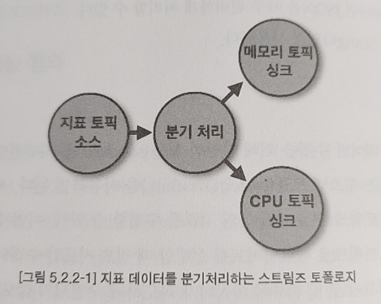
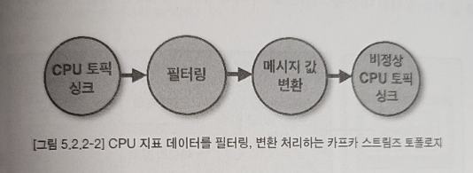
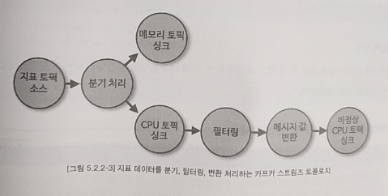

# 카프카 프로듀서,프로듀서와 스트림즈의 차이

### 카프카 프로듀서, 컨슈머모델을 사용 시

- 프로듀서는 KafkaTemplate 또는 커스텀 프로듀서로 데이터를 생성한다.
- 컨슈머는 @KafkaListener 에서 받아서 데이터/이벤트를 리슨한다.

이 방식에서는 요청이 단건으로 급증할 때 스레드 풀 처리를 해줘야 한다. (간헐적인 대용량은 아직 경험해보지 않아 모른다.)

예를 들면 아래와 같은 방식이다.

 

#### 프로듀서

- 데이터를 생산할 때 
  - 인메모리 캐시로 구현한 작업 큐에 넣어준다.
  - 완벽하게 큐 라는 자료구조라기 보다는 Set 자료구조 1개 + Map 자료구조 1개로 쌍을 맞춘다.
  - 가급적 순서를 강제하기 보다는 자연적인 순서를 부여할 수 있도록 한다.
    - 이 경우 보통 LocalDateTime, OffsetDateTime 과 작업을 고유하게 식별할수 있는 시퀀스 등을 응용하면 데이터가 순서없이 들어와도 어떤것이 먼저 정렬되어야하는지 기준을 잡을 수 있다.
- 별도의 데몬스레드에서 인메모리 캐시 작업 큐를 소모
  - 별도로 스레드 풀 기반의 스케쥴링된 ExecutorService 에서 인메모리 캐시의 작업을 일정사이즈 (e.g. 100개) 만큼 가져온 뒤 그 만큼을 일괄처리 (Push)한다.

 

#### 컨슈머

- Listen 할 때 
  - Listen 한 데이터를 @KafkaListener로 소비할 때 인메모리 캐시에 들어있는 데이터를 인메모리 작업 큐에 넣어준다.
  - 이렇게 하는 이유는 Listen 하는 로직은 가급적 지연이 없도록 돕기 위해서.
- 별도의 데몬 스레드에서 인메모리 캐시 작업 큐를 소모
  - 별도로 스레드 풀 기반으로 스케쥴링 된 ExecutorService 에서 인메모리 캐시의 작업을 일정사이즈 (e.g. 100개)만큼 가져온 뒤 그 만큼을 일괄처리(DB/일라스틱서치저장/하둡저장 등)를 수행한다.

 

### 카프카 스트림즈

토픽 여러 개를 합쳐서 다른 토픽으로 만드는 등의 작업을 한다. 

스트림즈 애플리케이션은 별도로 구성하는 편이 낫고, 별도로 배포되는 편인 것 같다. 

스트림즈는 토픽과 토픽사이를 요청을 보냈다가 받으면서 후처리를 하고 등의 그런 연산을 한다. 

 

여러 곳에 위치한 프로듀서/컨슈머를 지도를 보며 조합하듯 제어하는 개념. 각각의 프로듀서/컨슈머의 동작은 프로듀서/컨슈머레벨에서의 처리이기에 관여하지 않아도 된다는 점은 편리하군. 

더 자세한 설명은 조금씩 시간을 내서 정리해야겠다. 사이드 프로젝트를 준비중이어서 바빠졌다ㅠ 

 

##### KStream, StreamsBuilder, Topology, etc

KStream 은 Topic 하나에 대한 데이터 발생 시에 대해 수행할 작업을 기술한다. 즉시 실행이 아니다. 즉, 하나의 식(Expression) 같은 개념이다. 

StreamsBuilder 를 이용해 KStream 들을 조합(branch, join, map, filter 등) 할수 있다. 이 Builder 패턴 객체를 build() 메서드로 마무리하면, Topology 라는 객체가 도출된다.

Topology 는 각각의 스트림들을 그래프로 표현해서 어떤 노드(토픽)에서 어떤 노드로 이동할지에 대한 개념을 의미한다. 

 

#### 카프카 스트림즈는 여러개의 topic 들을 조합한다.

역시 이 부분도 조금씩 시간을 내서 정리 예정.

사이드 프로젝트를 해야겠다는 이상한 강박감이 들어서 설명은 잠시 패스.

1\)

- 지표를 처리하는 KStream

 

2\) 

- CPU 토픽을 처리하는 KStream

 

3\) 

- 1\) 과 2\) 를 Streams 를 통해 조합한 결과다.

